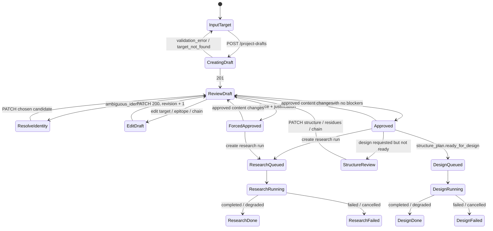

# 前端 API Contract：Target Bootstrap 与运行闸门

本文定义 UI 与未来 HTTP adapter 的稳定边界。现有业务逻辑位于
`target_bootstrap.py`、`structure_resolution.py`、`agents/research.py` 和
`agents/design.py`；HTTP 路由尚未实现。前端应只依赖本 contract，而不依赖
JSON 文件路径、CLI 文本输出或 Python 异常字符串。

## 1. 约定

- Base URL：`/api/v1`
- JSON：`Content-Type: application/json; charset=utf-8`
- 标识符均由服务端生成，前端将 `draft_id`、`project_id`、`run_id` 当作 opaque string。
- `PATCH` 使用 RFC 7396 JSON Merge Patch；数组是整体替换，不是按元素合并。
- 所有时间为 ISO-8601 UTC；所有枚举值使用 snake_case。
- `x_backend_status` 标明该路由是否已有业务实现：`implemented` 表示可直接用现有
  Python 函数包装；`adapter_required` 表示 UI contract 已冻结，但需增加异步任务 adapter。

## 2. 通用响应与错误

成功响应：

```json
{
  "data": {},
  "request_id": "req_01J..."
}
```

失败响应：

```json
{
  "error": {
    "code": "review_required",
    "message": "Project config is not approved.",
    "details": {
      "blocking_issues": ["ambiguous_identifier_requires_user_selection"]
    }
  },
  "request_id": "req_01J..."
}
```

前端应按 `code` 决策，而不是解析 `message`。推荐映射：

| HTTP | code | UI 行为 |
|---|---|---|
| 400 | `validation_error` | 在字段旁显示 `details.field_errors` |
| 404 | `draft_not_found` / `project_not_found` | 返回项目列表 |
| 409 | `ambiguous_identifier` | 强制用户选择 resolved candidate |
| 409 | `review_required` / `approval_invalidated` | 回到审核页 |
| 409 | `structure_not_ready` | 打开结构与表位审核区 |
| 422 | `unsupported_route` | 隐藏/禁用该设计路线 |
| 503 | `llm_unavailable` | 仅当 adapter 在持久化 draft 前选择失败时使用；推荐默认仍创建 draft，并提示可手工补全 |

## 3. 资源模型

### `ProjectDraft`

```ts
type ReviewStatus = "draft" | "approved";
type StructureStatus =
  | "experimental_selected"
  | "predicted_selected"
  | "prediction_low_confidence"
  | "prediction_required";

interface ProjectDraft {
  draft_id: string;
  project_id: string;
  name: string;
  modality: "cyclic_peptide" | string;
  objective: "binder" | "multi_target_binder" | string;
  targets: TargetDraft[];
  bootstrap: BootstrapMetadata;
  review: Review;
}

interface TargetDraft {
  id: string;
  uniprot?: string | null;
  protein_name?: string | null;
  organism?: string | null;
  required: boolean;
  binding_site: BindingSite;
  structure?: { pdb_id?: string; chain?: string; source?: string };
  structure_plan?: StructurePlan;
  uncertainties: string[];
}

interface BindingSite {
  description?: string | null;
  residues: number[];
  status?: "known" | "hypothesis" | "user_supplied" | "user_reviewed" | "unknown";
  confidence?: "high" | "medium" | "low" | "user_review_required";
  source_refs?: string[];
}

interface StructurePlan {
  status: StructureStatus;
  quality_grade: "A" | "B" | "C" | "D";
  coordinates_ready: boolean;
  binding_site_reviewed: boolean;
  chain_reviewed: boolean;
  ready_for_design: boolean;
  needs_ensemble: boolean;
  required_next_step: string;
  selected?: StructureRecord | null;
  experimental_candidates: StructureRecord[];
  predicted_candidates: StructureRecord[];
}

interface Review {
  status: ReviewStatus;
  revision: number;
  content_digest: string;
  approved_digest?: string;
  blocking_issues: string[];
  warnings: string[];
  checklist: {
    target_identity_resolved: boolean;
    binding_site_reviewed: boolean;
    structure_reviewed: boolean;
    ready_to_approve: boolean;
  };
}
```

`review.status=approved` 只表示可以启动 Research。Design 还必须满足
`structure_plan.ready_for_design=true`；即坐标、target chain 和表位 residues 都已审核。

## 4. Bootstrap 与审核路由

| Method / path | `x_backend_status` | 对应 Python 逻辑 |
|---|---|---|
| `POST /project-drafts` | implemented | `TargetBootstrapper.create_draft()` |
| `GET /project-drafts/{draft_id}` | adapter_required | 读取 draft artifact |
| `PATCH /project-drafts/{draft_id}` | implemented | `edit_draft()` |
| `POST /project-drafts/{draft_id}/approve` | implemented | `approve_draft()` |
| `GET /project-drafts/{draft_id}/review` | implemented | `review_project_config()` |

### 创建 draft

`POST /project-drafts`

```json
{
  "identifier": "Q00987",
  "identifier_type": "uniprot",
  "organism_id": 9606,
  "epitope": "p53-binding cleft",
  "objective": "binder"
}
```

`201 Created`：

```json
{
  "data": {
    "draft_id": "drf_01J...",
    "project_id": "mdm2_cycpep",
    "review": {
      "status": "draft",
      "revision": 1,
      "blocking_issues": [],
      "warnings": [
        "MDM2:binding_site_residues_missing_or_hypothetical",
        "MDM2:structure_not_design_ready:review_target_chain_and_epitope_coordinates"
      ]
    },
    "targets": [{
      "id": "MDM2",
      "uniprot": "Q00987",
      "structure_plan": {
        "status": "experimental_selected",
        "quality_grade": "A",
        "coordinates_ready": true,
        "binding_site_reviewed": false,
        "chain_reviewed": false,
        "ready_for_design": false,
        "required_next_step": "review_target_chain_and_epitope_coordinates"
      }
    }]
  },
  "request_id": "req_01J..."
}
```

LLM 无法调用时仍返回 `201`；`bootstrap.llm_status=failed` 和 review warning 会提示
用户手工填写。身份有多个候选时，draft 保留 `bootstrap.resolved_candidates`，批准会返回
`409 ambiguous_identifier`，直到用户通过 PATCH 明确选择。

### 修改 draft

`PATCH /project-drafts/{draft_id}`，`Content-Type: application/merge-patch+json`

```json
{
  "targets": [{
    "id": "MDM2",
    "binding_site": {
      "description": "Reviewed p53-binding cleft",
      "residues": [54, 93, 96],
      "status": "user_reviewed",
      "confidence": "high",
      "source_refs": ["E001"]
    },
    "structure": {"pdb_id": "1YCR", "chain": "A"}
  }]
}
```

`200 OK` 返回完整新 draft。每次修改都会把 `review.status` 复位为 `draft`、递增
`revision`，并重新计算 warnings。若修改 target ID、UniProt 或结构，服务端必须重新解析
`structure_plan`，不能复用旧结构评估。

### 批准

`POST /project-drafts/{draft_id}/approve`

```json
{"force": false}
```

阻断项存在时返回 `409 review_required`。受控例外：

```json
{
  "force": true,
  "justification": "Proceed with literature-only research while resolving isoform ambiguity."
}
```

强制批准必须记录 justification，并在 UI 中显示审计标记。成功后：

```json
{
  "data": {
    "project_id": "mdm2_cycpep",
    "review": {
      "status": "approved",
      "revision": 2,
      "approved_digest": "sha256...",
      "forced": false
    }
  }
}
```

## 5. Research 与 Design run contract

这些路由需要一个小型异步 adapter：创建任务、持久化 `Run`、调用现有
`agents.research.run()` 或 Design 函数。不要让浏览器直接启动 Python 子进程。

```ts
type RunStatus = "queued" | "running" | "completed" | "degraded" | "failed" | "cancelled";
interface Run {
  run_id: string;
  project_id: string;
  kind: "research" | "design";
  status: RunStatus;
  progress: { stage: string; completed: number; total?: number; message?: string };
  created_at: string;
  started_at?: string;
  finished_at?: string;
  result?: Record<string, unknown>;
  error?: { code: string; message: string };
}
```

| Method / path | 前置条件 | `x_backend_status` |
|---|---|---|
| `POST /projects/{project_id}/research-runs` | config approved | adapter_required |
| `POST /projects/{project_id}/design-runs` | config approved + target design-ready | adapter_required |
| `GET /runs/{run_id}` | run exists | adapter_required |
| `POST /runs/{run_id}/cancel` | queued/running | adapter_required |

Research request：

```json
{"force_recompute": false}
```

Design request（用于 UI 的小规模 smoke test）：

```json
{
  "route": "structure_guided",
  "target_id": "MDM2",
  "candidate_count": 1,
  "lengths": [8]
}
```

服务端必须为 `candidate_count` 设置项目级上限，且只接受已配置的 target。非 MDM 项目
请求 `motif_graft` 或 `atsp_cyclize` 时返回 `422 unsupported_route`。

轮询建议：queued/running 每 2 秒一次；completed/degraded/failed/cancelled 后停止。任务
事件流以后可替换为 SSE/WebSocket，响应模型不变。

## 6. 前端状态机



UI 按钮规则：

| 条件 | Approve | Start research | Start design |
|---|---:|---:|---:|
| `blocking_issues.length > 0` | 禁用（仅显示 force flow） | 禁用 | 禁用 |
| draft、无阻断项 | 可用 | 禁用 | 禁用 |
| approved、digest 有效 | 不适用 | 可用 | 仅 `ready_for_design=true` 时可用 |
| approved 后编辑 | 不适用 | 禁用 | 禁用 |
| run 为 queued/running | 保持只读 | 禁用重复提交 | 禁用重复提交 |

## 7. Adapter 实现清单

1. 以数据库或 artifact store 映射 opaque `draft_id` 到 JSON artifact；禁止把本地绝对路径交给浏览器。
2. 通过 API 层把 `BootstrapError`、`ReviewRequiredError`、`StructureNotReadyError` 规范化为上面的 error envelope。
3. 为每个长任务保存 `Run`、日志摘要和结果 URI；不把 LLM API key、原始系统 prompt 或内部文件路径返回前端。
4. 所有 approve、force approve、cancel、run start 记录 actor、时间、revision 和 request_id，供 Critic/Reporter 审计。
5. 在 adapter 层强制候选数、并发 run 数和 GPU 队列限制；浏览器提供的数值不可直接传给计算工具。
