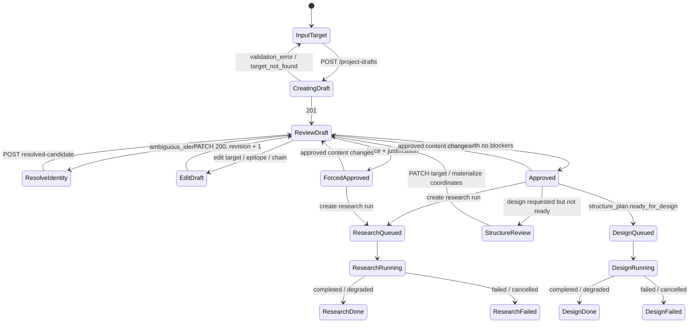

# 前端 API Contract：Target Bootstrap 与运行闸门

本文定义 UI 与未来 HTTP adapter 的稳定边界。现有业务逻辑位于
`target_bootstrap.py`、`structure_resolution.py`、`agents/research.py` 和
`agents/design/`（CLI 入口仍为 `agents/design.py` shim）；HTTP 路由尚未实现。前端应只依赖本 contract，而不依赖
JSON 文件路径、CLI 文本输出或 Python 异常字符串。

## 1. 约定

- Base URL：`/api/v1`
- JSON：`Content-Type: application/json; charset=utf-8`
- 标识符均由服务端生成，前端将 `draft_id`、`project_id`、`run_id` 当作 opaque string。
- `PATCH` 使用 RFC 7396 JSON Merge Patch；数组是整体替换，不是按元素合并。靶点编辑
  必须走 target-specific 路由，禁止前端 PATCH 完整 `targets` 数组。
- 所有时间为 ISO-8601 UTC；所有枚举值使用 snake_case。
- `x_backend_status` 标明该路由是否已有业务实现：`implemented` 表示可直接用现有
  Python 函数包装；`adapter_required` 表示 UI contract 已冻结，但需增加异步任务 adapter。

## 2. 通用响应与错误

成功响应：

```json
{
  "data": {},
  "request_id": "req_01J..."
}
```

失败响应：

```json
{
  "error": {
    "code": "review_required",
    "message": "Project config is not approved.",
    "details": {
      "blocking_issues": ["ambiguous_identifier_requires_user_selection"]
    }
  },
  "request_id": "req_01J..."
}
```

前端应按 `code` 决策，而不是解析 `message`。推荐映射：

| HTTP | code | UI 行为 |
|---|---|---|
| 400 | `validation_error` | 在字段旁显示 `details.field_errors` |
| 404 | `draft_not_found` / `project_not_found` | 返回项目列表 |
| 409 | `ambiguous_identifier` | 强制用户选择 resolved candidate |
| 409 | `review_required` / `approval_invalidated` | 回到审核页 |
| 409 | `structure_not_ready` | 打开结构与表位审核区 |
| 422 | `unsupported_route` | 隐藏/禁用该设计路线 |
| 503 | `llm_unavailable` | 仅当 adapter 在持久化 draft 前选择失败时使用；推荐默认仍创建 draft，并提示可手工补全 |

## 3. 资源模型

### `ProjectDraft`

```ts
type ReviewStatus = "draft" | "approved";
type StructureStatus =
  | "experimental_selected"
  | "predicted_selected"
  | "prediction_low_confidence"
  | "prediction_required";

interface ProjectDraft {
  draft_id: string;
  project_id: string;
  name: string;
  modality: "cyclic_peptide" | string;
  objective: "binder" | "multi_target_binder" | string;
  targets: TargetDraft[];
  bootstrap: BootstrapMetadata;
  review: Review;
}

interface TargetDraft {
  id: string;
  uniprot?: string | null;
  protein_name?: string | null;
  organism?: string | null;
  required: boolean;
  binding_site: BindingSite;
  structure?: TargetStructure;
  structure_plan?: StructurePlan;
  uncertainties: string[];
}

interface TargetStructure {
  pdb_id?: string;
  model_id?: string;
  chain?: string;
  source?: string;
  quality_grade?: "A" | "B" | "C" | "D";
  coordinate_artifact_id?: string; // opaque；绝不返回服务器本地路径
  coordinate_sha256?: string;
  coordinate_format?: "pdb" | "cif";
}

interface BindingSite {
  description?: string | null;
  residues: number[];
  status?: "known" | "hypothesis" | "user_supplied" | "user_reviewed" | "unknown";
  confidence?: "high" | "medium" | "low" | "user_review_required";
  source_refs?: string[];
}

interface StructurePlan {
  status: StructureStatus;
  quality_grade: "A" | "B" | "C" | "D";
  coordinates_selected: boolean;
  coordinates_ready: boolean;
  binding_site_reviewed: boolean;
  chain_reviewed: boolean;
  ready_for_design: boolean;
  needs_ensemble: boolean;
  required_next_step: string;
  selected?: StructureRecord | null;
  experimental_candidates: StructureRecord[];
  predicted_candidates: StructureRecord[];
}

interface StructureRecord {
  id: string;
  source: "rcsb" | "alphafold_db" | string;
  kind: "experimental" | "predicted";
  pdb_id?: string;
  chain?: string;
  method?: string | null;
  resolution?: number | null;
  coverage?: number | null;
  has_bound_partner?: boolean;
  model_version?: number | string | null;
  mean_plddt?: number | null;
  epitope_plddt?: number | null;
  pae_available?: boolean;
  quality_grade: "A" | "B" | "C" | "D";
  quality_reason: string;
  epitope_confidence_missing: boolean;
  url?: string | null;
  pdb_url?: string | null;
  cif_url?: string | null;
  pae_url?: string | null;
}

interface BootstrapMetadata {
  input: { identifier: string; identifier_type: string; organism_id: number };
  resolved_candidates: Array<Record<string, unknown>>;
  selected_candidate?: Record<string, unknown>;
  ambiguous_identifier: boolean;
  evidence: Array<Record<string, unknown>>;
  llm_status: "complete" | "failed";
  llm_model: string;
  llm_error?: string | null;
  assumptions: string[];
}

interface Review {
  status: ReviewStatus;
  revision: number;
  content_digest: string;
  approved_digest?: string;
  forced?: boolean;
  justification?: string | null;
  blocking_issues: string[];
  warnings: string[];
  checklist: {
    target_identity_resolved: boolean;
    binding_site_reviewed: boolean;
    structure_reviewed: boolean;
    ready_to_approve: boolean;
  };
}
```

`review.status=approved` 只表示可以启动 Research。Design 还必须满足
`structure_plan.ready_for_design=true`；即坐标 artifact 已在后端落盘并验证、target chain
和表位 residues 都已审核。`coordinates_selected=true` 只表示发现了结构元数据，不能启动 Design。

## 4. Bootstrap 与审核路由

| Method / path | `x_backend_status` | 对应 Python 逻辑 |
|---|---|---|
| `POST /project-drafts` | implemented | `TargetBootstrapper.create_draft()` |
| `GET /project-drafts/{draft_id}` | adapter_required | 读取 draft artifact |
| `PATCH /project-drafts/{draft_id}` | implemented | `edit_draft()`；仅允许 name/objective/selection 等项目级字段 |
| `PATCH /project-drafts/{draft_id}/targets/{target_id}` | implemented | `edit_target_draft()` |
| `POST /project-drafts/{draft_id}/resolved-candidate` | implemented | `select_resolved_candidate()` |
| `POST /project-drafts/{draft_id}/targets/{target_id}/coordinates` | implemented | `materialize_draft_coordinates()` |
| `POST /project-drafts/{draft_id}/approve` | implemented | `approve_draft()` |
| `GET /project-drafts/{draft_id}/review` | implemented | `review_project_config()` |

### 创建 draft

`POST /project-drafts`

```json
{
  "identifier": "Q00987",
  "identifier_type": "uniprot",
  "organism_id": 9606,
  "epitope": "p53-binding cleft",
  "objective": "binder"
}
```

`201 Created` 的 `data` 必须是完整 `ProjectDraft`，创建后无需额外 GET 才能进入审核页：

```json
{
  "data": {
    "draft_id": "drf_01J...",
    "project_id": "mdm2_cycpep",
    "name": "MDM2 cyclic peptide binder",
    "modality": "cyclic_peptide",
    "objective": "binder",
    "bootstrap": {
      "input": {"identifier": "Q00987", "identifier_type": "uniprot", "organism_id": 9606},
      "resolved_candidates": [{"id": "MDM2", "uniprot": "Q00987"}],
      "ambiguous_identifier": false,
      "evidence": [{"evidence_id": "E001", "source": "UniProt", "id": "Q00987"}],
      "llm_status": "complete",
      "llm_model": "step-3.7-flash",
      "llm_error": null,
      "assumptions": []
    },
    "targets": [{
      "id": "MDM2",
      "uniprot": "Q00987",
      "protein_name": "E3 ubiquitin-protein ligase Mdm2",
      "organism": "Homo sapiens",
      "required": true,
      "binding_site": {
        "description": "p53-binding cleft", "residues": [],
        "status": "user_supplied", "confidence": "user_review_required", "source_refs": []
      },
      "structure": {"pdb_id": "1YCR", "source": "rcsb", "quality_grade": "A"},
      "uncertainties": [],
      "structure_plan": {
        "status": "experimental_selected",
        "quality_grade": "A",
        "coordinates_selected": true,
        "coordinates_ready": false,
        "binding_site_reviewed": false,
        "chain_reviewed": false,
        "ready_for_design": false,
        "needs_ensemble": false,
        "required_next_step": "materialize_selected_coordinates",
        "selected": {
          "id": "1YCR", "pdb_id": "1YCR", "source": "rcsb", "kind": "experimental",
          "resolution": 2.1, "quality_grade": "A",
          "quality_reason": "high-resolution experimental structure",
          "epitope_confidence_missing": true,
          "pdb_url": "https://files.rcsb.org/download/1YCR.pdb"
        },
        "experimental_candidates": [{
          "id": "1YCR", "pdb_id": "1YCR", "source": "rcsb", "kind": "experimental",
          "resolution": 2.1, "quality_grade": "A",
          "quality_reason": "high-resolution experimental structure",
          "epitope_confidence_missing": true,
          "pdb_url": "https://files.rcsb.org/download/1YCR.pdb"
        }],
        "predicted_candidates": []
      }
    }],
    "review": {
      "status": "draft", "revision": 1, "content_digest": "sha256...",
      "blocking_issues": [],
      "warnings": [
        "MDM2:binding_site_residues_missing_or_hypothetical",
        "MDM2:structure_not_design_ready:materialize_selected_coordinates"
      ],
      "checklist": {
        "target_identity_resolved": true, "binding_site_reviewed": false,
        "structure_reviewed": false, "ready_to_approve": true
      }
    }
  },
  "request_id": "req_01J..."
}
```

LLM 无法调用时仍返回 `201`；`bootstrap.llm_status=failed` 和 review warning 会提示
用户手工填写。身份有多个候选时，draft 保留 `bootstrap.resolved_candidates`，批准会返回
`409 ambiguous_identifier`，直到用户通过显式候选选择路由完成服务端校验。

### 修改 draft

`PATCH /project-drafts/{draft_id}/targets/{target_id}`，
`Content-Type: application/merge-patch+json`

```json
{
  "binding_site": {
    "description": "Reviewed p53-binding cleft",
    "residues": [54, 93, 96],
    "status": "user_reviewed",
    "confidence": "high",
    "source_refs": ["E001"]
  },
  "structure": {"pdb_id": "1YCR", "chain": "A"}
}
```

`200 OK` 返回完整新 draft。每次修改都会把 `review.status` 复位为 `draft`、递增
`revision`，并重新计算 warnings。即使只修改 binding-site residues/status，也必须重算
`binding_site_reviewed` 和 `ready_for_design`；修改 target ID、UniProt 或结构来源时必须重新发现结构。
`structure_plan`、identity 字段、`metric_slug` 和 coordinate artifact 元数据属于服务端字段，
target PATCH 必须拒绝它们。结构来源或 ID 触发重新发现时，旧 coordinate path/hash 必须失效。

### 选择已解析候选

`POST /project-drafts/{draft_id}/resolved-candidate`

```json
{"candidate_ref": "Q00987"}
```

服务端只能接受 `bootstrap.resolved_candidates` 中恰好匹配一个的 `id` 或 `uniprot`，随后更新
target identity、记录 `bootstrap.selected_candidate`、清除 ambiguity 并重算结构。前端不能直接修改
`bootstrap.ambiguous_identifier`。如果选择结果改变了 target identity，服务端必须清空旧身份的
binding site、natural partners、known binders、off-targets 和 research queries，并要求重新研究/
审核；不得把原蛋白的表位带到新蛋白。成功返回完整 `ProjectDraft`。

### 物化结构坐标

`POST /project-drafts/{draft_id}/targets/{target_id}/coordinates`

```json
{"structure_record_id": "1YCR"}
```

服务端验证该记录属于候选列表，只允许后端配置的 HTTPS host（默认 RCSB/AlphaFold DB，
重定向也必须重新校验 host），下载并验证坐标格式，写入后端控制的 artifact store，
记录强制 SHA-256，并在响应中只暴露 opaque `coordinate_artifact_id`。只有此步骤成功后
`coordinates_ready` 才能为 true。不得接受浏览器提供的本地路径或任意下载 URL。

### 批准

`POST /project-drafts/{draft_id}/approve`

```json
{"force": false}
```

阻断项存在时返回 `409 review_required`。受控例外：

```json
{
  "force": true,
  "justification": "Proceed with literature-only research while resolving isoform ambiguity."
}
```

强制批准必须记录 justification，并在 UI 中显示审计标记。所有 draft mutation 的成功响应
都返回完整 `ProjectDraft`；下面只突出 approval 后发生变化的字段：

```json
{
  "data": {
    "project_id": "mdm2_cycpep",
    "review": {
      "status": "approved",
      "revision": 2,
      "approved_digest": "sha256...",
      "forced": false
    }
  }
}
```

## 5. Research 与 Design run contract

这些路由需要一个小型异步 adapter：创建任务、持久化 `Run`，并为每个 run 启动隔离的
Python worker。现有 Research/Design 模块在 import 时加载项目配置，因此 persistent worker
不得在同一解释器中顺序执行不同项目。adapter 必须先把该 run 的已批准 config 固化为只读
artifact，再为子进程设置 `CYCPEP_PROJECT_CONFIG=<artifact path>`，最后才 import/执行
`agents.research` 或 `agents.design`。不要让浏览器直接启动 Python 子进程。

```ts
type RunStatus = "queued" | "running" | "completed" | "degraded" | "failed" | "cancelled";
interface Run {
  run_id: string;
  project_id: string;
  kind: "research" | "design";
  project_config_revision: number;
  approved_digest: string;
  status: RunStatus;
  progress: { stage: string; completed: number; total?: number; message?: string };
  created_at: string;
  started_at?: string;
  finished_at?: string;
  result?: Record<string, unknown>;
  error?: { code: string; message: string };
}
```

| Method / path | 前置条件 | `x_backend_status` |
|---|---|---|
| `POST /projects/{project_id}/research-runs` | config approved | adapter_required |
| `POST /projects/{project_id}/design-runs` | config approved + digest 有效 + target design-ready + 坐标 artifact 可读且 hash 匹配 | adapter_required |
| `GET /runs/{run_id}` | run exists | adapter_required |
| `POST /runs/{run_id}/cancel` | queued/running | adapter_required |

Research request：

```json
{"force_recompute": false}
```

Design request（用于 UI 的小规模 smoke test）：

```json
{
  "route": "structure_guided",
  "target_id": "MDM2",
  "candidate_count_total": 1,
  "lengths": [8]
}
```

`candidate_count_total` 是所有 requested lengths 合计的候选预算，不是每个长度的数量。
adapter 必须先生成并返回 `effective_plan.counts_by_length`，各值之和必须严格等于
`candidate_count_total`；调用现有 `design_afcyc(n=..., lengths=[L])` 时一次只传一个长度，
防止 `n * lengths.length` 绕过上限。服务端同时限制总预算、长度数量、并发 run 数，且只接受
已配置的 target。非 MDM 项目请求 `motif_graft` 或 `atsp_cyclize` 时返回
`422 unsupported_route`。

```json
{
  "data": {
    "run_id": "run_01J...",
    "status": "queued",
    "effective_plan": {"candidate_count_total": 5, "counts_by_length": {"8": 3, "10": 2}}
  }
}
```

轮询建议：queued/running 每 2 秒一次；completed/degraded/failed/cancelled 后停止。任务
事件流以后可替换为 SSE/WebSocket，响应模型不变。

## 6. 前端状态机



UI 按钮规则：

| 条件 | Approve | Start research | Start design |
|---|---:|---:|---:|
| draft 且 `blocking_issues.length > 0` | 禁用（仅显示 force flow） | 禁用 | 禁用 |
| draft、无阻断项 | 可用 | 禁用 | 禁用 |
| approved、digest 有效 | 不适用 | 可用 | 仅 `ready_for_design=true` 时可用 |
| force-approved、digest 有效 | 不适用 | 可用并显示风险标记 | 禁用，除非结构闸门也独立满足 |
| approved 后编辑 | 不适用 | 禁用 | 禁用 |
| run 为 queued/running | 保持只读 | 禁用重复提交 | 禁用重复提交 |

## 7. Adapter 实现清单

1. 以数据库或 artifact store 映射 opaque `draft_id` 到 JSON artifact；禁止把本地绝对路径交给浏览器。
2. 通过 API 层把 `BootstrapError`、`ReviewRequiredError`、`StructureNotReadyError` 规范化为上面的 error envelope。
3. 为每个长任务保存 `Run`、日志摘要和结果 URI；不把 LLM API key、原始系统 prompt 或内部文件路径返回前端。
4. 所有 approve、force approve、cancel、run start 记录 actor、时间、revision 和 request_id，供 Critic/Reporter 审计。
5. 在 adapter 层强制候选数、并发 run 数和 GPU 队列限制；浏览器提供的数值不可直接传给计算工具。
6. run 必须绑定 `{project_id, project_config_revision, approved_digest}`；worker 启动后再次校验
   digest，输出目录也必须按 project/run 隔离，禁止复用 import 时加载的其他项目全局状态。
7. Design 入队前强制验证 coordinate artifact 存在、可读、SHA-256 字段存在且匹配；Design
   直接读取批准配置中的内部 `coordinate_path`，不得再次从未规范化 target ID 拼文件名。
   兼容旧项目时才回退到 `CYCPEP_TARGET_ROOT/<pdb_id>.pdb`。元数据候选存在不等于坐标就绪。
