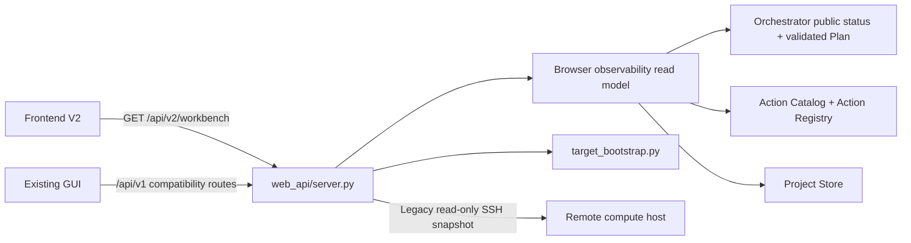

# CycPep Studio Web GUI：兼容实现与 Frontend V2 接入边界

更新时间：2026-08-09

> 本轮是 backend-first 的可观测性变更，`web-gui/` production code 保持不变。PR #26 仅作为
> workbench、项目上下文、候选、结构、证据、artifact 和可观测性 UX/product 参考；其代码、
> controller、workflow state 与 API 假设都不是实现依赖或基线。

## 1. 结论与真实性边界

现有 Web GUI 是以真实结构为中心的 AI Drug Discovery Workbench。左侧呈现 Agent
Workflow 和候选，中间保留最大空间给真实三维结构，右侧呈现七层评分、证据、结构化决策记录
和只读参数，底部呈现运行日志、GPU 队列与 Artifact。它不再内置 MDM2/MDMX 项目、候选、
阶段进度、证据或示例三维模型。后端不可达时，界面只显示“未连接真实工作环境”。

这仍是 `/api/v1` 兼容界面，不代表当前后端执行模型。当前执行是 Planner typed-task graph →
Orchestrator → Action Registry → ExecutionWorker → transaction/Store；任务可包含依赖、审批、
不可用 action、失败和未解决恢复状态，而不是固定四阶段 Agent 流水线。Frontend V2 后续应以
只读 `GET /api/v2/workbench` 为 workflow authority，直接呈现 task graph、action availability、
正式 transaction 状态和 structured blockers。

当前可以真实完成的操作：

- 通过 `State.load()` 读取 `state.json` 的运行阶段、轮次和项目字段。
- 通过 `CandidateIndex.load()/stats()` 读取候选与七层统计。
- 通过 `EvidenceLogger.get_all()` 读取追加式证据日志。
- 通过 `TargetBootstrapper.create_draft()` 创建服务端草稿。
- 使用服务端返回的 `draft_id` 与 `targets` 立即切换到新草稿。
- 通过 `edit_target_draft()` 保存靶点审核修改，通过 `approve_draft()` 批准。
- 在适配层同机读取工作目录，或由适配层通过 SSH 读取远端工作目录。

SSH 模式当前是严格只读；远端项目创建、审核修改和任务启动尚未转发，因此 UI 在 SSH
连接生效时禁用“新建靶点草稿”。同机模式的草稿操作会写入适配层所在项目。

当前没有实现，因此 UI 明确保持禁用的能力：

- Research/Design/Prediction 的异步任务队列与取消。
- SSH 远端坐标 artifact 转发。
- 持久化的用户、权限、审计主体和 SSH 连接配置。

## 2. 现有 v1 兼容界面的数据源映射

下表只描述尚未迁移的现有 GUI，不是 Frontend V2 的 workflow read contract。即使这些兼容
projection 可用于旧界面展示，也不得用 `State.phase`、evidence 数量、日志文本或固定 Agent
顺序推导当前 run/task/transaction 状态。

| UI 信息 | 唯一数据源 | 禁止行为 |
|---|---|---|
| 项目与运行阶段 | `State.load()` | 前端猜测缺失的 `project_id` 或 phase |
| 候选及 L1-L7 | `CandidateIndex.load()` | 内置候选或用 weighted score 代替七层判定 |
| 最终科学通过数 | `all_layers_pass == true` | 把 `final_status=finalized` 当成七层全清 |
| 证据链 | `EvidenceLogger.get_all()` | 伪造事件、工具输出或时间线 |
| 审核草稿 | `target_bootstrap.py` | 创建失败后生成 local draft |
| 三维坐标 | 后端 artifact registry | 浏览器读取任意本地路径或任意 URL |

`state.json` 是 Agent 写入的全局运行态看板，不是完整项目配置的永久数据库。批准后的 `project_config` 应通过 `State.sync_project_config(config)` 同步，阈值则通过 `State.sync_thresholds_from_cache()` 投影。当前仓库中的旧 `data/state.json` 缺少 `project_id`、`project_config` 和 `approved_digest`；GUI 会原样报告完整性警告，不自动补值。

## 3. 组件与网络边界

浏览器不读取文件系统、不启动 Python、不执行 SSH，也不接收私钥。`web_api/server.py` 是安全边界：本地模式调用正式数据层；SSH 模式使用参数数组启动系统 SSH，不经过 shell 拼接。
Frontend V2 的候选、证据、artifact 和 transaction 元数据来自正式 Store seam；JSON/CSV/JSONL
是单向兼容 projection，不是第二份 authority，也不能用于补全或覆盖工作流状态。

## 4. 两种部署方式

### A. 本地 UI，连接云端计算服务器

1. 在本机启动适配层：`python web_api/server.py --host 127.0.0.1 --port 8765`。
2. 在适配层进程环境登记密钥，例如 `CYCPEP_SSH_KEY_GPU1=/secure/gpu1_ed25519`。
3. 预先把计算服务器主机指纹加入运行适配层用户的 `known_hosts`。
4. 本地启动 UI，在“连接”页填 API 地址 `http://127.0.0.1:8765/api/v1`。
5. 选择 SSH 远端模式，填写 host、port、username、key alias `gpu1` 和远端项目目录。

网页不提供密码或私钥输入框。SSH 连接使用 `BatchMode=yes` 和 `StrictHostKeyChecking=yes`；缺少已登记密钥或主机指纹时连接必须失败。

### B. 在计算服务器运行 UI，直接接入同机环境

1. 在项目根目录启动适配层，并让其继承正确的 `CYCPEP_PROJECT_CONFIG`、`CYCPEP_DATA_DIR`、`CYCPEP_EVIDENCE_DIR`。
2. 启动 `web-gui`，将反向代理的 `/api/v1` 指向适配层的 `127.0.0.1:8765`。
3. UI 的 API 地址保留 `/api/v1`，选择“服务器同机模式”。

生产环境应使用 HTTPS、同源反向代理和身份认证，不应把 8765 端口直接暴露到公网。

## 5. 当前 HTTP 接口

| Method | Path | 状态 |
|---|---|---|
| GET | `/api/v1/health` | 已实现 |
| GET | `/api/v1/projects` | 已实现，列出运行态与服务端草稿 |
| GET | `/api/v1/snapshot` | 已实现；仅兼容旧客户端，不是 Frontend V2 workflow authority |
| POST | `/api/v1/connections/ssh` | 已实现，测试 SSH 并返回快照与临时 connection ID |
| POST | `/api/v1/connections/ssh/snapshot` | 已实现，刷新临时 SSH 连接 |
| POST | `/api/v1/project-drafts` | 已实现 |
| GET | `/api/v1/project-drafts/{draft_id}` | 已实现 |
| PATCH | `/api/v1/project-drafts/{draft_id}/targets/{target_id}` | 已实现 |
| POST | `/api/v1/project-drafts/{draft_id}/approve` | 已实现 |
| GET | `/api/v1/artifacts/{artifact_id}/coordinates` | 已实现；仅返回七层全清且 manifest/hash 验证通过的本地坐标 |
| GET | `/api/v2/workbench` | Frontend V2 只读聚合；当前项目与经校验的当前 run/task graph |
| POST/GET | run queue endpoints | 未实现 |

`/api/v2/workbench` 使用 opaque identifiers，并返回 `project`、`workflow`、`run`、`tasks`、
`executions`、`transactions`、`candidates`、`evidence`、`artifacts`、`protocols`、`trace` 与
`blockers`。项目科学记录可包含当前 run、历史 run 或未关联记录；当前-run collections 不能混入
历史状态。有界 collection 用 `total`、`returned`、`truncated` 和 `items` 明示截断。该接口
没有 start/retry/cancel/dispatch 等 mutation，也不会因读取而初始化或刷新任何正式状态或兼容
projection。

## 6. 结构可视化接入要求

可视化依次要求：候选记录 `all_layers_pass=true`；manifest 与坐标文件存在；坐标位于
`CYCPEP_ARTIFACT_ROOTS` allow-list 内；后端重新计算 SHA-256 并与索引记录匹配；registry
生成 opaque `artifact_id`；坐标接口只从 registry 返回 PDB/mmCIF。浏览器不得提交路径或
下载 URL。当前 UI 使用 3Dmol.js 渲染接口返回的真实内容；任一条件不满足时只展示明确的
空工作区，不展示示例分子。

## 7. 上线前剩余工程

1. 增加身份认证、项目级授权、CORS allow-list 和审计 actor。
2. 把内存 SSH connection ID 换成加密、短时、服务端持久化 session。
3. 将当前进程内 artifact registry 换成持久化 registry，并补远端 SSH artifact 转发。
4. 实现 run 数据模型、SSE 事件流、GPU 串行队列、子进程隔离和 digest 二次校验。
5. 给每个项目隔离 `CYCPEP_DATA_DIR`/`CYCPEP_EVIDENCE_DIR`，避免多项目 import 全局状态串线。
6. 将已批准 config 用 `State.sync_project_config()` 同步后再允许 Research/Design。
7. 为本地、SSH、draft create/switch、断线、旧 state 完整性警告和 artifact gate 增加集成测试。
